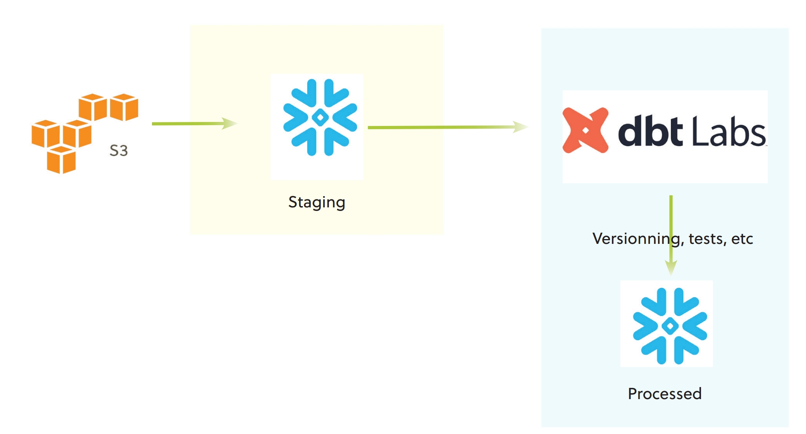

# Chess end to end project

## ETL with Snowflake & dbt

Pipeline :

S3 -> Snowflake -> dbt -> Snowflake -> BI (TODO)




## Setup:

Follow the instructions in the [Snowflake documentation](https://docs.snowflake.com/en/user-guide/data-load-s3)

- Store csv or parquet files in S3
- [Optional] Create a user in Snowflake
- Create a (some) table(s) in Snowflake
- Create a policy to allow Snowflake Read/Write access to the S3 bucket
- Create a stage in Snowflake
- Bulk load the data from S3 to Snowflake
- Install dbt and Snowflake connector (https://docs.getdbt.com/dbt-cli/installation) ```bash pip install dbt-snowflake```

- Create a dbt profile (https://docs.getdbt.com/dbt-cli/configure-your-profile)
- Create a dbt project (https://docs.getdbt.com/reference/commands/init)
```bash dbt init my_project```
- Install dbt packages (https://docs.getdbt.com/docs/package-management)
```bash dbt deps```
- Create a dbt model (https://docs.getdbt.com/docs/building-a-dbt-project/building-models)
- Test and run the model
```bash dbt test; dbt run```


## TODO

- Add more tests
- Look around dvt packages possibilities
- Finish the merge model to update datas
- Add a BI tool (Tableau, PowerBI, Looker, etc.)
- Dockerize the project